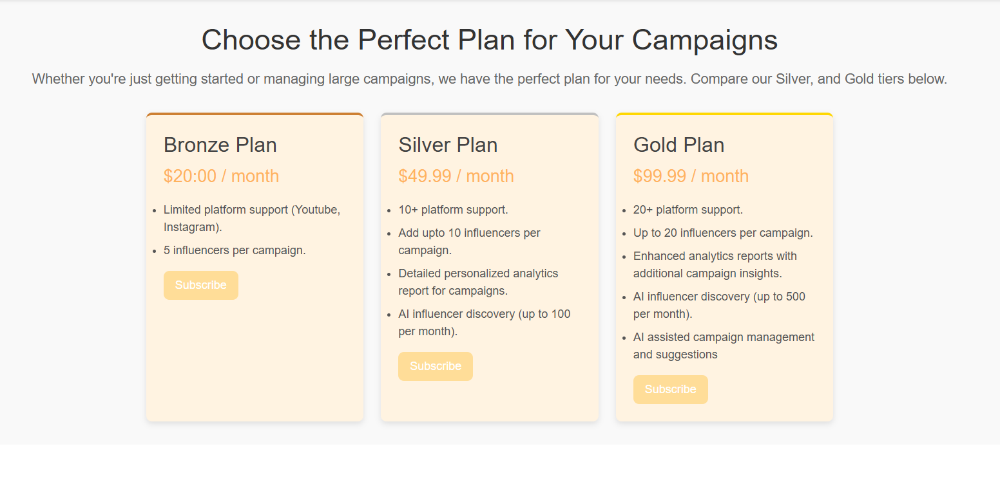

# 🎯 **Influencer Brand Campaign Management Platform**  

### **Welcome to the Next Generation of Influencer Marketing!**  
In a world ruled by social media, our platform is your ultimate ally, connecting brands with influencers to create impactful campaigns. Say goodbye to manual management and guesswork—this platform combines **AI-powered insights**, **cutting-edge APIs**, and **intuitive design** for effortless collaboration and exceptional results.  

👉 [**Watch the Demo Video Here**](https://genny.lovo.ai/share/b04c109c-5d69-441f-be8f-6a51cc4b6e15)  

---

## 📋 **Subscription Details**
  
💡 *Interested in transforming this into a full-fledged business? Let's collaborate!*  
📧 Contact: **mrpolymathematica@gmail.com**  

---

## ❓ **Why This App is a Game-Changer**  

In today's fast-paced digital marketing world, brands face countless challenges:  

- **Finding the Right Influencers**: Matching influencers to campaign goals can feel like finding a needle in a haystack.  
- **Managing Campaigns**: Juggling multiple influencers and tracking their performance is overwhelming.  
- **Lack of Transparency**: Evaluating ROI and campaign success remains a mystery.  
- **Scalability Issues**: Existing solutions buckle under the weight of large campaigns.  

✨ **Our platform solves these problems by providing:**  
- Streamlined influencer discovery tools.  
- Comprehensive campaign management capabilities.  
- Granular analytics and performance tracking.  
- Scalable architecture to support campaigns of any size.  

---

## 🌟 **Core Features**  

### 1️⃣ **Authentication & Authorization**  
- **Secure Login**: Token-based authentication with short-lived access tokens and HTTP-only refresh tokens.  
- **Seamless Experience**: Silent token rotation prevents interruptions.  
- **Ironclad Passwords**: scrypt hashing ensures your data stays safe.  
- **Role-Based Access**: Assign permissions based on user roles (influencer, brand, admin).  

---

### 2️⃣ **Influencer Integration**  
- **Phyllo API**: Fetch influencer stats (followers, engagement rates, post performance).  
- **YouTube API**: Track influencer performance manually.  
- **Instaloader**: Scrape Instagram influencer data with proxy support.  
- **Future Upgrade**: Instagram API integration for faster, more reliable data.  

---

### 3️⃣ **Effortless Influencer Discovery**  
- Filter by **niche**, **follower count**, **engagement rate**, and more.  
- **AI-Powered Matching**: Predict campaign success with a unique success score.  

---

### 4️⃣ **Powerful Campaign Management**  
- **Create & Manage** campaigns in minutes.  
- Approve or reject influencer collaboration requests.  
- Limit the number of influencers per campaign.  
- Built-in **Chat Interface** for private negotiations.  
- **Task-Based Progress Tracking**: Ensures accountability for every campaign milestone.  
- Metrics to measure success:  
  - **InfluencerSocials**: Tracks social media posts and impact.  
  - **BrandSocials**: Monitors brand follower growth during campaigns.  
  - **UTM Links**: Granular tracking via Google Analytics.  

---

### 5️⃣ **Performance Tracking & Analytics**  
- **Task Progress**: See real-time completion percentages for influencer tasks.  
- **Goal Progress**: Aggregate metrics from InfluencerSocials, BrandSocials, and UTM Links.  
- Detailed **individual contribution reports** for influencers.  

---

### 6️⃣ **Built for Scale**  
- **Redis**: Blazing-fast caching for high-performance endpoints.  
- **Celery**: Asynchronous task management with scheduled jobs.  
- **Distributed Architecture**: Phyllo API, Redis, and Celery work independently for maximum scalability.  

---

### 7️⃣ **Real-Time Notifications**  
- **Gmail SMTP**: Instant email alerts for signups, password resets, and campaign updates.  

---

### 8️⃣ **Admin Superpowers**  
- Flag or delete accounts and campaigns with ease.  
- **Transparent Notifications** for every admin action.  

---

### 9️⃣ **Sleek UI Design**  
- A clean, minimalistic interface ensures users only see what matters.  
- Intuitive navigation for a stress-free experience.  

---

## 🛠️ **Technical Implementation**  

### 🔒 **Security**  
- **Tokens**: HTTP-only refresh tokens with silent rotation.  
- **Passwords**: scrypt hashing for ultimate protection.  
- **CORS Policies**: Restrict API access to specific origins.  

---

### 📊 **Campaign Progress Tracking**  
- **Task Progress**: Monitor task completion with brand-approved milestones.  
- **Goal Progress**:  
  - **InfluencerSocials**: Measures impact via likes, views, and shares.  
  - **BrandSocials**: Tracks follower and engagement growth.  
  - **UTM Links**: Leverages Google Analytics for detailed traffic reports.  

---

### 💡 **Backend Services**  
- **Redis**: Speeds up response times by caching data.  
- **Celery**: Handles background tasks like data syncing and notifications.  
- **Phyllo API & Instaloader**: Robust integration for influencer data.  

---

### ⚙️ **Infrastructure**  
- **Docker Support**: Fully configured Docker files for seamless containerization.  
- **Layered MVC Pattern**:  
  - **Model**: Central database for all campaign data.  
  - **View**: Clean and responsive client-side logic.  
  - **Controller**: Handles application logic effortlessly.  

---

## 🔚 **Conclusion**  

The **Influencer Brand Campaign Management Platform** is more than just a tool—it’s a revolution in influencer marketing. With powerful integrations, AI-driven insights, and a focus on user experience, brands can amplify their campaigns while influencers enjoy a structured, transparent collaboration process.  

🎯 Whether you're a brand aiming for maximum ROI or an influencer looking for clarity and opportunities, this platform delivers **results that matter.**  

---

💡 **Ready to take the leap?** Let’s collaborate and shape the future of influencer marketing.  
📧 Contact: **mrpolymathematica@gmail.com**